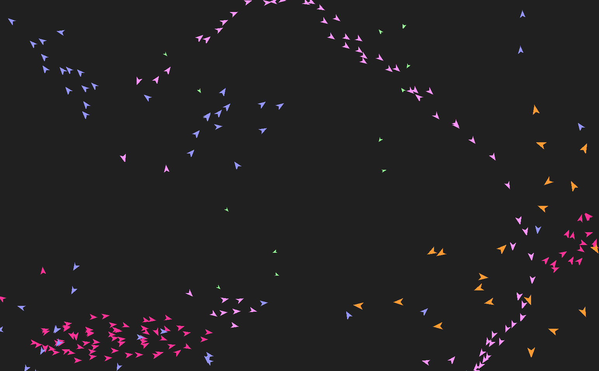

# Python Projects

Greetings and welcome to this Repo! \
This is a small collection of my favorite python projects for you to experiment and play around with. \
Here's an Overview:

- [A* Pathfinding](#a-pathfinding-)
- [Boids Simulation](#boids-simulation-)
- [Cloth Simulation](#cloth-simulation-)

## A* Pathfinding [↗](https://github.com/NicoNoell/Python-Projects/tree/main/A%20Star%20Pathfinding)
A* ("A-Star") pathfinding is a popular and especially efficient Algorithm for computing the shortest path between a start- and endpoint in (almost) any graph. 
### How it works:
**1.** First of all, you'll need a (fast) **estimation function** that cannot under-estimate the remaining distance to the end from any given node. The better the estimation, the faster the algorithm will be on average. Because I'm working with a sqare grid, this function is easily given by going diagonally until you're in line with the goal and then going straight.

**2.** Then you'll want to **calculate the estimated total cost** of each currently reachable node. This is done by just taking the sum of the path-cost from the start and the estimated (optimal) distance to the end. In my Program, I used a cost of 10 for a straight and a cost of 14 (roughly sqrt(2) * 10) for the diagonals.

**3.** Now that the estimated cost has been calculated, you **choose the node with the least total cost** and calculate the cost of all of its neighbors. If one of the neighbors already had an estimated distance to start, it gets overwritten if the new one provides a shorter path. Then you repeat from step 2 until the endpoint is reached, which looks something like this:

(The number in the top-left refers to the estimated distance to the end and the number in the top-right is the slowly discovered distance to the start)

**4.** Once you've reached the goal, you need to **backtrack to the start** to reconstruct the actual path taken. This is done by starting at the end node and always choosing the neighboring node with the lowest distance to the start. You could alternatively just keep track of where each node has its distance to start from, which is the typical way to do this, but I used the first method.

#### Where it doesn't work:
If a graph has edges with negative weights, the algorithm cannot gurantee to have found the optimal path, as it is possible the the end is discovered before the negative weight can come into effect. It also only works with one starting- and one endpoint.

### Further Resources
I have also described the algorithm on my website and made a video about it. If your interested with further engaging with the topic, see the following links:
- [The A* Pathfinding Algorithm (Wikipedia)](https://en.wikipedia.org/wiki/A*_search_algorithm)
- [A* explained on my website with code-samples](https://niconoell.github.io/projects/projects.html)
- [My Video about it (Youtube)](https://www.youtube.com/watch?v=B5ITrAc1kEo)

## Boids Simulation [↗](https://github.com/NicoNoell/Python-Projects/tree/main/Boids)
This Boids Simulation is refering to the simulation of the swarm behavoir of fish or a flock of birds. It's really fun to watch :).

### How it works:
The simulation itself isn't very complicated, as the swarm behavior emerges from the following three very basic rules:

**1.** A boid always tries to move into the center of the flock in its field of view (FOV). \
**2.** A boid get's pushed away from its peers it if gets too close.\
**3.** A boid tries to match the average velocity and direction of other boids in its FOV.

By simply applying those rules (and a force pulling them into the window) in the right balance and with a slight tweak for each swarm (indicated by a different color), you get something that looks like the following:

  
Something I personally really like is observing the general patterns in which those flocks move. The purple ones for example tend to form a fast line, whereas the pink boids often stay in a denser swarm. Blue is something in between, green speeds through the window every now and then and orange likes to keep its distance. 

### Further Resources
If you're interested, there's tons of interesting things people have done similar to this and a quick google search can have you hooked for a few hours. Still, here are some links that might be helpful:
- [Boids (Wikipedia)](https://en.wikipedia.org/wiki/Boids)
- [A Web demonstration by Ben Eater with adjustable parameters](https://eater.net/boids)

## Cloth Simulation [↗](https://github.com/NicoNoell/Python-Projects/tree/main/Cloth%20Simulation)